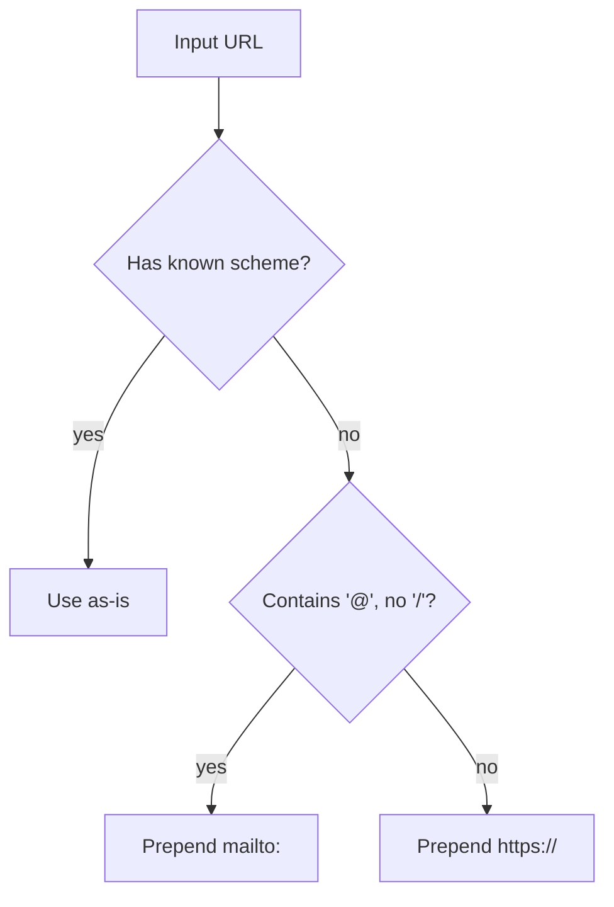

# Custom URL Slots

## Overview

A profile button does not have to wrap a Revit command. It can point at a URL, a `mailto:` address, or a local file path. This lets admins fold company resources — the BIM standards wiki, the SharePoint library, the helpdesk inbox — into the same ribbon people already use, without asking anyone to remember a separate set of bookmarks.

https://github.com/user-attachments/assets/3e216ab3-2597-400e-9010-cbb45df10b89

## Supported link types

| Type | Example | How it opens |
|---|---|---|
| HTTPS URL | `https://bimstandards.example.com` | Default browser |
| HTTP URL | `http://intranet.local` | Default browser |
| Bare hostname | `bimstandards.example.com` | Default browser (normalised to `https://`) |
| Email address | `support@example.com` | Default mail client (normalised to `mailto:`) |
| `mailto:` link | `mailto:bim@example.com` | Default mail client |
| File path | `file://C:/Shared/Standards.pdf` | Default handler for that file type |
| `ftp://` URL | `ftp://files.example.com` | Default FTP handler |
| `tel:` link | `tel:+441234567890` | Default phone/dialler app |

## How the URL is opened

rst-c hands the resolved link to Windows via `ShellExecute` (the same mechanism Windows uses when you double-click a file or click a hyperlink). The operating system routes it to whichever application is registered as the default handler for that scheme or file type.

### Normalisation rules

The Builder lets admins type links in natural form. rst-c applies these rules before storing and before opening:

Known schemes that pass through unchanged: `http://`, `https://`, `mailto:`, `ftp://`, `file://`, `tel:`.

A bare email like `support@example.com` becomes `mailto:support@example.com`. A bare hostname like `bimstandards.example.com` becomes `https://bimstandards.example.com`. Anything else with no recognised scheme also gets `https://` prepended.

> [!class2]
> Normalisation is deliberate and simple — rst-c does not validate that the resulting URL resolves or that the target exists. The link is stored as typed and normalised at open time.

## Notes & limits

- URL slots use the same button shape as command slots — they get a name, an icon, and a panel assignment in the Builder like any other tool.
- There is no live preview of URL slots in the Builder; the link is tested by applying the profile and clicking the button.
- File paths in `file://` format must be absolute. Relative paths are not supported. UNC network paths (`\\server\share\…`) are not supported.
