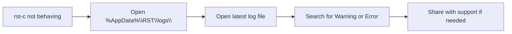

# Logging

[](https://md-converter.designs-os.com/?url=https://github.com/jedbjorn/rst-c/blob/main/docs/logging.md)

## Overview

rst-c writes structured logs using Serilog. Logs from both the C# engine and the WebView2-hosted UI (Loader, Builder) land in the same rolling log file, so a single file captures the full picture of a session when something goes wrong.

## Log location

Logs are written to:

```
%AppData%\RST\logs\
```

The directory is created on first launch. Log files roll by session; older files are pruned automatically so the directory does not grow without bound.

The active log is the first place to look when a profile does not apply as expected, when the Loader shows an error, or when Revit exhibits unexpected behaviour after rst-c loads.

## Log content

### C# engine events

The engine logs at structured information and warning level throughout its lifecycle:

- **Bootstrap** — DLL resolution, engine load path, engine version, OnStartup result
- **Profile operations** — profile list reads, active profile reads and writes, profile apply, switch scheduling
- **Ribbon building** — tab creation, panel construction, slot registration, colour application, branding panel setup
- **RSTify** — tabs hidden and shown, icon update, profile switch tab-lift
- **Required add-ins** — scan results, auto-enable outcomes, missing add-in names
- **Health** — scan start, hardware readings collected, cleanup targets, files deleted and skipped
- **Errors** — exceptions are logged with full stack traces at Warning or Error level

### WebView2 UI events

The Loader and Builder UIs run in a WebView2 host. JavaScript-side errors and application events are bridged to the C# log via a `log_event` call, so they appear in the same file as engine events with a `[UI]` marker. This means a single log captures both what the C# host did and what the JavaScript UI reported.

### Bootstrap log

Before the main Serilog sink is initialised, the bootstrap process (the thin `RST.Bootstrap` thunk that loads the engine from `%AppData%\RST\R<NN>\app\`) writes to a separate early-boot log at the same location. This log captures DLL resolution steps and is the first place to look if rst-c does not appear in Revit's ribbon at all.

## Reading the log



Log entries are plain text with a timestamp, level, and message. Searching for `[Warning]` or `[Error]` is usually enough to find the relevant entry. The surrounding `[Information]` entries provide context (which profile was loading, which tab was being built) without needing to read the whole file.

## Notes & limits

- Log files are per-user, under `%AppData%\RST\logs\`. Each Windows user on the machine has their own log directory.
- Logs do not contain model content, user data, or network information. They record rst-c's own operations only.
- The log retention policy caps the total size of the logs directory. Once the cap is reached, the oldest files are pruned. The cap is set conservatively — a few dozen sessions of normal use will not fill it.
- If the logs directory is missing entirely, rst-c failed to initialise its file sink. Check the bootstrap log path and verify that `%AppData%\RST\` is writable by the current user.
