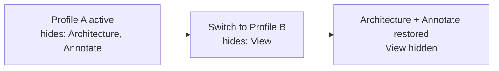

# Ribbon Tools

[](https://md-converter.designs-os.com/?url=https://github.com/jedbjorn/rst-c/blob/main/docs/ribbon-tools.md)

## Overview

Two ribbon-level tools come with every rst-c install: **RSTify**, which hides tabs the active profile does not use, and **Required Add-ins**, which checks and enforces the add-in dependencies a profile declares. Both are profile-aware and both are accessible from the Loader.

## RSTify

### What it does

RSTify is a tab-hiding mode. When enabled, rst-c hides every Revit and add-in tab the active profile did not draw commands from, leaving the rst-c tab and any tabs the profile explicitly preserves. The ribbon narrows to just the tools the profile provides.

The intent is to remove the route back into the unfiltered Revit ribbon mid-session. A curated ribbon is only effective if users work from it — RSTify removes the distraction of the full tab bar while keeping the escape hatch (turning RSTify off) obvious and one click away.

### Turning RSTify on and off

The RSTify button is on the RST panel of the Add-Ins tab. The button icon shows the current state — tabs-hidden (on) or tabs-visible (off). Clicking it toggles the state and the icon updates immediately.

The Loader also exposes a toggle in its footer, next to the Apply button, so the user can set RSTify state as part of choosing a profile.

### How admin defaults work

The admin sets a default RSTify state and a list of tabs to hide in the Builder, stored in the profile's `presets` field. When a user applies the profile for the first time, those defaults are used. After the user has overridden them, their preference (stored in `active_profile.json`) takes priority on every subsequent apply — the admin default only seeds the first load.

### Switching profiles with RSTify active

When a profile is switched, rst-c lifts the previous profile's hidden tabs before applying the new profile's hide rules. A tab hidden by profile A is never left stranded-hidden when profile B is applied, even if profile B does not list that tab at all.



### What RSTify can and cannot hide

RSTify sets `IsVisible` on `Autodesk.Windows.RibbonTab` objects — the same property pyRevit's RSTify used. It can hide any tab that Revit's AdWindows layer exposes, including native Revit tabs and add-in tabs. The rst-c tab itself is never hidden.

> [!class4]
> AdWindows is an unsupported Autodesk API. It is de-facto stable across Revit versions but Autodesk does not guarantee backward compatibility. This is the same caveat pyRevit carried.

## Required add-ins

### What it does

A profile can declare the add-ins it depends on. On Apply, rst-c checks the live Revit session against that list and takes one of three actions per entry:

| Status | What happened | rst-c action |
|---|---|---|
| Installed and active | `.addin` manifest present, not disabled | No action needed |
| Installed but disabled | `.addin.RSTdisabled` found on disk | Auto-enables for next Revit launch |
| Not installed | No matching manifest | Surfaces a download link to the user |

### Auto-enabling disabled add-ins

When rst-c finds a required add-in that is disabled (its `.addin` manifest has been renamed to `.addin.RSTdisabled`), it renames it back to `.addin`. This takes effect on the next Revit launch — add-in DLLs already loaded in the current session do not hot-reload, so a restart is required and rst-c notifies the user.

### Surfacing missing add-ins

When a required add-in is not found on the machine, rst-c shows its display name and, if the profile includes one, a download URL. The URL is baked into the profile at build time from a curated registry in the Builder — if the registry knew the add-in's download page at profile-creation time, the user gets a clickable link. If not, the name alone is shown.

### How matching works

rst-c matches required add-ins against the `.addin` manifests on disk using a three-tier policy:

```linear
Tier 1: match by addin filename (case-insensitive) :::class1 -> Tier 2: match by AddInId GUID :::class2 -> Tier 3: fuzzy match by ribbon tab title or display name :::class3
```

Tier 3 handles the common case where the installed `.addin` filename differs from what the builder's registry recorded (for example, the registry says `Lumion.addin` but the install ships `LumionLiveSync.addin`). The fuzzy match checks whether the live ribbon has a tab whose title contains the required add-in's tab name (or vice versa), and whether any manifest's display name or file stem is a substring match. This mirrors the logic the Loader's picker uses to decide whether an add-in shows as "Loaded", so the two views agree.

## Notes & limits

- RSTify uses tab titles to identify tabs. Tabs with identical titles (rare but possible with some add-ins) will both be affected by a hide rule targeting that title.
- Auto-enabling a disabled add-in requires write access to the Revit add-in directory. On machines where the add-in directory is locked down, the rename may fail — rst-c logs the failure and surfaces the add-in as still requiring attention.
- The required add-in check runs on Apply, not on Loader open. A profile's requirements are evaluated against the machine it is applied on, not the machine it was built on.
- Profiles built before the required add-in feature (pre-RST-022) have an empty `requiredAddins` list; the check is a no-op for them.
