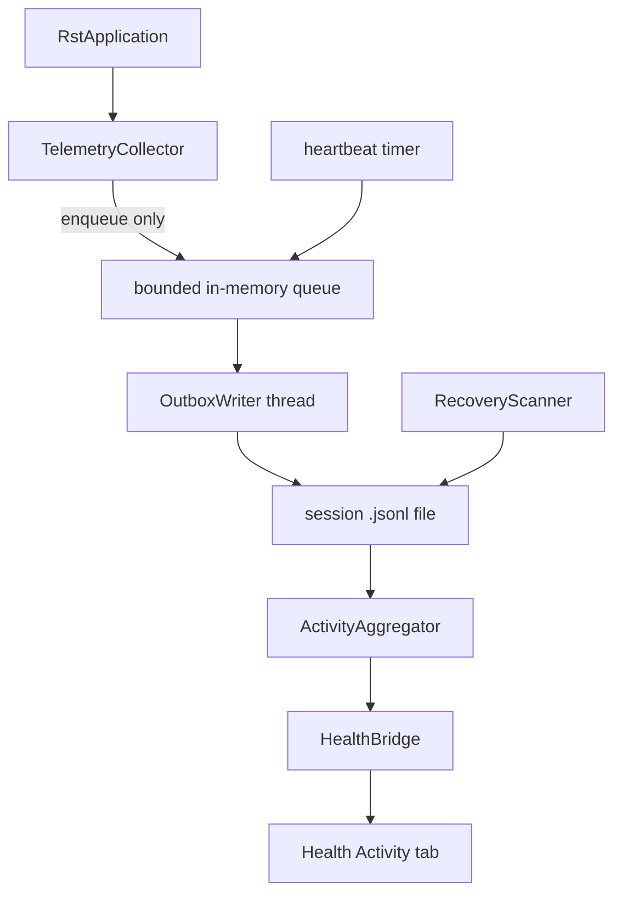

# Revit Activity Telemetry v1

## Overview

Collect per-user, per-machine Revit activity — session length, model open duration, sync-to-central duration, active vs. idle time — carrying enough raw identity on every event that a server can later resolve "which model, which project". v1 captures locally and shows the user **their own data** inside Revit. Nothing leaves the machine.

```stats
:::class1
value: local
label: v1 data boundary
description: No push, no server, no watcher
:::class2
value: JSONL
label: Outbox format
description: Append-only, one file per session
:::class3
value: on
label: Default state
description: First-run notice + user toggle
:::class4
value: 180d
label: Local retention
description: Independent of any future server ack
```

**Goals (v1)**

- Capture the full event set (sessions, opens, closes, syncs, activity pulses) with the complete identity block, push-ready from day one (`event_id`, `schema_version` on every line).
- An **Activity tab on the Health tool**: current session time plus smoothed history graphs for the current Revit file — session time, opening time, sync durations — filtered 7d/1m/3m/6m.
- The engine stays fork-ready for dos-arch: the outbox file contract is the stable seam; shipper, auth, and project mapping plug in later without changing captured data.

**Non-goals (v1)**

- No Postgres push, no shipper, no endpoint, no auth — designed-for, not built.
- No OS-level watcher; the add-in self-recovers via heartbeats (see Crash Recovery).
- No `.slog` backfill parser; no journal parsing.
- No cross-user or aggregate views — the dashboard shows only the current user's local data.

> [!class4]
> This is workplace activity monitoring. v1's local-only boundary keeps the consent posture light, but the disclosure requirement (research doc §7) re-opens in full the moment a shipper is integrated. Preserve the privacy-minimizing properties: no keystrokes, no content, throttled pulses only.

## Scope Decisions

Settled with the FnB 2026-07-18. Do not re-litigate in implementation; supersede explicitly if reality contradicts one.

| # | Decision | Rationale |
|---|---|---|
| 1 | **Capture + local dashboard only.** Outbox is push-ready; no shipper ships. | Integration specifics (endpoint, auth, trigger) belong to dos-arch — research doc §6 marks them TBD. |
| 2 | **No OS watcher in v1.** | Heartbeat + next-startup recovery covers crash closure. The watcher needs an install/update story that is platform-owned. |
| 3 | **JSONL outbox, not SQLite** (engine decision #2). | Native `e_sqlite3` risks version collisions in the shared `AssemblyLoadContext.Default` on Revit 2025/2026 (engine decision #1). Volume is small; the dashboard aggregates on demand. |
| 4 | **On by default + first-run notice + toggle.** | Fits the local-only boundary; opt-in would starve the data the dos-arch fork exists for. Posture re-opens at push time. |
| 5 | **Local retention is independent of sync — 180 days, confirmed.** | The research doc's delete-on-ack would erase the user's own dashboard history. Files prune by age, never by ack. |
| 6 | **Display surface: a tab on the Health tool** (FnB 2026-07-18). | Health is the natural home — the window, WebView2 host, bridge, and window plumbing already exist; no new ribbon button. The viewer gains a tab bar (Health / Activity). |

## Architecture

Three layers, strictly separated so the fork can lift the core without Revit or UI references:



| Component | Project | Responsibility |
|---|---|---|
| `TelemetryCollector` | `RST.Engine/Telemetry` | Subscribes to Revit events in `OnStartup`; captures identity on the UI thread (cheap reads only); enqueues typed records; throttles pulses. |
| `OutboxWriter` | `RST.Core/Telemetry` | Single background thread; owns the session file handle exclusively; append + flush per record; fsync on heartbeat and session_end. |
| `RecoveryScanner` | `RST.Core/Telemetry` | At startup (background), closes orphaned session files from crashed sessions. |
| `RetentionPruner` | `RST.Core/Telemetry` | At startup (background), deletes closed files older than the retention window. |
| `ActivityAggregator` | `RST.Core/Telemetry` | Parses outbox files, computes the Activity tab's series. Pure, unit-testable, no Revit refs. |
| Activity tab | `RST.UI/Health` + `health_viewer.html` | New tab in the existing Health window; `HealthBridge` gains activity methods delegating to the aggregator. No new window, no new ribbon button. |

**Placement rule:** `RST.Core/Telemetry` must compile with zero references to Revit API or WPF/WebView2 — it is the piece dos-arch lifts.

## Model Identity

Every document-scoped event carries the full block, null where not applicable. Capture raw; **never resolve linkage on the client** — resolution priority (cloud GUIDs → central GUID/path → creation-GUID lineage) is a server concern.

| Field | Source | Notes |
|---|---|---|
| `creation_guid` | `Document.CreationGUID` | Survives move/rename/copy/Save As — lineage, not uniqueness. |
| `version_guid`, `save_count` | `BasicFileInfo.Extract(local_path)` → `DocumentVersion` | Read the local file header only — **never** extract from a network/central path in a handler. Null on failure. |
| `cloud_project_guid`, `cloud_model_guid` | `doc.GetCloudModelPath()` → `GetProjectGUID()/GetModelGUID()` | Only when `doc.IsModelInCloud`. Definitive project link when present. |
| `central_guid` | `doc.WorksharingCentralGUID` | **Revit Server centrals only** (per Autodesk docs; throws otherwise — null). For ordinary file-share centrals this is null by design; `central_path` is the file-based key. |
| `central_path` | `doc.GetWorksharingCentralModelPath()` → user-visible path | Null for non-workshared and cloud models. |
| `local_path`, `title` | `doc.PathName`, `doc.Title` | Supporting metadata, never identity. |
| `is_workshared`, `is_cloud`, `is_family_doc`, `is_detached` | `doc.IsWorkshared`, `doc.IsModelInCloud`, `doc.IsFamilyDocument`, `doc.IsDetached` | Booleans; cheap property reads. |

Capture points: `doc_opened` (full block), `doc_saved` / `doc_saved_as` (full block re-captured — `save_count`/`version_guid`/paths change), all other doc events (join keys only: `creation_guid`, cloud GUID pair, `central_guid`, **and `central_path`** — every key the matching priority uses, so keys-only events stay joinable; per decision #3).

Every field read wraps in try/catch → null. An identity gap is data, never an exception surfaced to Revit.

## Event Schema

**Envelope — every line:**

```json
{
  "event_id": "uuid4, minted at creation",
  "session_guid": "uuid4, minted at OnStartup",
  "seq": 42,
  "ts": "2026-07-18T14:03:07.123Z",
  "event_type": "doc_opened",
  "schema_version": 1,
  "source": "addin"
}
```

- `seq` — per-session monotonic counter; gives total order within a session independent of clock changes.
- `ts` — always UTC ISO-8601; the dashboard converts to local for display.
- `source` — `addin` | `recovery`. Recovery-written events also carry `"synthetic": true`.
- `schema_version` is mandatory from day one; bump on any breaking shape change.

**Event set:**

| event_type | Revit trigger | Payload beyond envelope |
|---|---|---|
| `session_start` | `OnStartup` | `machine_name`, `install_id`, `os_user`, `autodesk_user` (`Application.Username` — capture **both**, they differ), `revit_version`, `revit_build`, `addin_version` |
| `heartbeat` | timer, every 2 min | `open_doc_count`. Fsynced — this is the crash-recovery anchor. |
| `doc_opening` | `DocumentOpening` | `local_path` (all that's known pre-open) |
| `doc_opened` | `DocumentOpened` | full identity block. Pair with `doc_opening` = load duration. |
| `doc_closing` | `DocumentClosing` | identity keys + `closing_id` (the args' id). `DocumentClosed` does **not** expose the Document — identity is captured here. |
| `doc_closed` | `DocumentClosed` | `closing_id`, `status` — correlated to `doc_closing` via `closing_id`. |
| `doc_saved` | `DocumentSaved` | re-captured identity block |
| `doc_saved_as` | `DocumentSavedAs` | re-captured block + `previous_local_path` — the Save-As lineage disambiguator (research doc §8). |
| `sync_start` | `DocumentSynchronizingWithCentral` | identity keys, `central_path`, `comment` |
| `sync_end` | `DocumentSynchronizedWithCentral` | identity keys, `status`. Pair = sync duration. |
| `doc_changed_pulse` | `DocumentChanged`, throttled | identity keys. **≤1 per document per minute.** The active-time signal — never per-transaction detail. |
| `view_activated` | `ViewActivated`, throttled | identity keys of the newly active doc. Emitted only when the **active document changes** (not every view switch), ≤1/min/doc. Attributes wall-clock across multiple open docs. |
| `session_end` | `OnShutdown` | none |
| `collection_disabled` / `collection_enabled` | user toggle | none — marker events framing gaps. |

**Active-time model (computed by the dashboard, never stored):** a minute containing ≥1 `doc_changed_pulse` counts as active for that document. Navigation-only time (orbiting, reviewing) produces no pulses and is undercounted — accepted for v1, inherited from the research doc.

## Outbox & Durability

**Layout — machine-scoped, deliberately NOT under the roaming `%AppData%\RST` root:**

```
%LOCALAPPDATA%\RST\telemetry\
  install_id                    — one generated GUID, minted on first run
  outbox\
    {install_id}_{session_guid}.jsonl
```

Roaming profiles sync `%AppData%`; an outbox that roams would merge events from different machines and collide on live files. `AppDataPaths` gains `TelemetryRoot` / `TelemetryOutboxDir` members resolving to `LocalApplicationData` (with the existing `OverrideRootForTests` pattern extended to cover them).

**Rules:**

- JSON Lines, append-only, one object per line. Never a JSON array.
- One file per Revit session — simultaneous Revit instances/versions never share a write target.
- The writer opens with `FileShare.Read` so the dashboard and future shipper can read the live file.
- Append + `Flush()` per record; `Flush(true)` (fsync) on every `heartbeat` and on `session_end`.
- A crash costs at most one partial trailing line; all readers skip unparseable lines.
- **Closed-file contract** (the seam the future shipper keys on): a file is closed ⟺ it contains a `session_end` event. The recovery scanner guarantees every non-live file reaches that state.
- Retention: at startup, a background prune deletes **closed** files whose newest event is older than 180 days (configurable in prefs). Prune never touches the live file or lock-held files.

## Crash Recovery

No OS watcher in v1 — the add-in closes its own orphans at next startup:

```linear
Scan outbox dir :::class1 -> Skip live and locked files :::class2 -> Find files lacking session_end :::class2 -> Append synthetic close records :::class3
```

For each orphaned file (no `session_end`, not locked by a concurrent Revit instance — probe by attempting an exclusive append-open):

1. Parse the file; note the last event's `ts` (the last heartbeat is at most 2 min before death) and which documents were opened but never closed.
2. If the file does not end with a newline (partial trailing line), append a newline first so the synthetic records start clean.
3. Append synthetic `doc_closed` per open doc, then a synthetic `session_end` — all with `ts` = last observed event's ts, `source: "recovery"`, `synthetic: true`, and `seq` continuing from the last parsed value.

Session length from a crashed session is therefore truncated to the last heartbeat — a bounded undercount of ≤2 minutes, never an overcount.

## Threading & Safety

The two rules that make this deployable:

> [!class4]
> Revit API events fire on the UI thread. Handlers do **cheap capture + enqueue only** — property reads and one local-file header read. No network paths, no disk writes, no locks held across API calls. Any measurable latency added to open/sync is a deployment killer.

> [!class4]
> Telemetry must never take Revit down. Every handler body and the whole writer thread wrap in try/catch: on failure, drop the event, log once to Serilog, keep running. Disk full, IO error, corrupt prefs — all degrade to "telemetry off", never to a crash or a dialog.

Mechanics:

- Bounded in-memory queue (cap ~10k records). If full (writer stalled), drop oldest and log a single degraded-mode warning per session.
- One writer thread owns all file IO — created at `OnStartup`, drained and joined (with timeout) at `OnShutdown` before `Log.CloseAndFlush()`.
- Heartbeat = `System.Threading.Timer` enqueueing like any handler; the writer performs the fsync when it sees a heartbeat record.
- Throttle state (per-doc last-pulse timestamps) lives in the collector, touched only on the UI thread — no cross-thread contention.
- `RecoveryScanner` and `RetentionPruner` run on a background task after `OnStartup` returns — never on the startup path.

## Activity Tab (Health)

The "presentation to the user of their own data" half lives as a **tab on the existing Health tool** — no new window, no new ribbon button. The Health viewer (today a single scrolling page) gains a tab bar: **Health** (current content, default) and **Activity**. The view is **current-file-centric**: it answers "how have I been working in *this* model", not machine-wide rollups.

**Layout, top to bottom:**

1. **Current session** — live session duration, ticking client-side from `session_start.ts` (no polling; the bridge hands the start timestamp once). Sub-line: current file's open duration this session.
2. **Range selector** — one segmented-pill control shared by all three graphs: `7D` (default) · `1M` · `3M` · `6M`. Max range 6 months sits safely inside the 180-day retention window by design.
3. **Session time — this file** — line graph, one point per calendar day in range: hours this file was open that day (from `doc_opened`/`doc_closed` pairs, crash-recovered closes included).
4. **Opening time — this file** — line graph, one point per open event: load duration in seconds (`doc_opening` → `doc_opened` pair), plotted at the open's timestamp.
5. **Sync history — this file** — line graph, one point per sync: duration in seconds (`sync_start` → `sync_end` pair), plotted at the sync's timestamp. Hidden with an explanatory empty state for non-workshared files.
6. **Footer** — collection toggle + status line (enabled?, outbox size, oldest event).

**Graphs — each its own chart, all three smoothed:**

- Rendered as **inline SVG** in `health_viewer.html` — the asset is CSP-locked (`connect-src 'self'`, no external origins), so no CDN chart library; a small shared chart helper in the asset draws axis, path, and hover dots.
- Smoothing: **monotone cubic interpolation** (Fritsch–Carlson), not a plain Catmull-Rom spline — same smooth look, but the curve never overshoots below zero between points, so a fast sync next to a slow one can't render as a negative duration.
- Empty/sparse states are first-class: <2 points in range → dots without a curve + "not enough history yet"; zero points → quiet empty state per graph.

**"Current file" matching:** the aggregator filters events to the active document using the same priority order the server would — cloud GUID pair → central GUID (Revit Server) → normalized `central_path` (file-based centrals; case-insensitive ordinal comparison of the user-visible path) → `creation_guid` — matching display to eventual server semantics. (`central_path` was added to the priority when SC-032 established that `WorksharingCentralGUID` is Revit Server-only; without it, file-share centrals would fall through to creation-GUID lineage and merge copies.) This is presentation-time filtering only; it does not violate the no-client-resolution rule (raw events stay raw).

**Plumbing:**

- `HealthContext` gains the active doc's identity keys (creation/cloud/central GUIDs **+ central path**) — captured in `HealthCommand` where model name/path are already captured today.
- `HealthBridge` gains: `GetActivity(rangeDaysJson)` → `{ session: {startTs, currentFileOpenTs}, file: {matchedKeys, perDayOpenHours[], openEvents[], syncEvents[]}, status: {...} }`, and `SetTelemetryEnabled(json)`. Aggregation runs in `ActivityAggregator` (RST.Core); the bridge returns small precomputed JSON — the HTML never parses JSONL. Zero-arg/one-string-arg method-arity rules from the existing bridge apply.
- Reads include the live session file (`FileShare.Read` on the writer makes this safe); "today" is always current.
- **No active document** (Health opened doc-less): current session block renders; the three file graphs show a "no model open" empty state.

Per-machine, per-user scope is inherent: the tab reads this machine's outbox only (`%LOCALAPPDATA%` is per-user), and only ever shows the current user's own activity.

## Consent & Config

Prefs file: `%AppData%\RST\telemetry_prefs.json` (Roaming — user preferences legitimately follow the user), `UserProfilePrefs`-style single JSON:

```json
{ "enabled": true, "noticeShownUtc": null, "retentionDays": 180 }
```

- **First-run notice:** on the first enabled session where `noticeShownUtc` is null, show a one-time Revit `TaskDialog` at `ApplicationInitialized`: what is collected (sessions, model opens, sync times, activity minutes — no keystrokes, no model content), that it stays on this machine, and where to see it (Health → Activity tab) and turn it off. Set `noticeShownUtc` regardless of how it's dismissed.
- **Toggle** (Activity tab footer): immediate. Disabling writes a `collection_disabled` marker, stops the heartbeat, unsubscribes nothing (handlers check one volatile bool and return). Enabling writes `collection_enabled` and resumes. Disabled state persists across sessions; a disabled session writes no session file at all.
- Existing outbox data remains viewable in the Activity tab while disabled; the user can see what was recorded.

## Fork Boundaries

What dos-arch integration will add, and what it must NOT have to change. The **outbox file contract is the stable seam**: envelope shape, `schema_version`, file naming, the closed-file rule, delete-only-on-ack (and never inside the retention window).

Preserved as open integration questions — surfaced, not assumed (research doc §6):

- Where the outbox lives when the host is dos-arch, and who owns its lifecycle.
- Sync trigger: host schedule vs own timer vs on-demand.
- Auth mechanism for the Postgres/API endpoint.
- How project → identity mappings (central paths, claimed creation GUIDs) are declared and stored platform-side.
- How/where the OS watcher is installed and updated relative to the host app.
- Server ingest schema — append-only, idempotent upsert on `event_id` (`ON CONFLICT DO NOTHING`); aggregates in views downstream.

**Engineering constraints that keep the fork cheap:** `RST.Core/Telemetry` has no Revit/UI references; identity is captured raw (no client-side resolution to undo); `install_id` + `machine_name` + `os_user`/`autodesk_user` ride every `session_start` so server-side attribution needs no local state.

## Edge Cases

Named and decided — not discovered in code review:

| Case | Behavior |
|---|---|
| Concurrent Revit instances (incl. same version twice) | Separate session GUIDs → separate files by construction. Recovery skips lock-held files. |
| Crash mid-write | ≤1 partial trailing line; readers skip it; recovery appends after a defensive newline. |
| Linked documents | **Excluded** — `doc.IsLinked` filtered at every doc-scoped handler. Only primary user documents are tracked. |
| Family editor documents | Included, flagged `is_family_doc` — dashboard may group them separately. |
| Detached models | Captured with `is_detached: true`; central keys null; creation_guid still links lineage. |
| Save As mid-session | `doc_saved_as` records old + new path and re-captured identity; subsequent events carry the new block. Server-side disambiguation stays possible (research doc §8). |
| Save As siblings in the Activity tab | Non-workshared siblings share `creation_guid` → the current-file filter merges their history. Accepted for v1 (matches server lineage semantics); cloud/central-keyed files are unaffected. |
| Health opened with no document | Current-session block renders; the three file graphs show a "no model open" empty state. |
| Sparse graph ranges | <2 points in range → dots, no curve; smoothing never invents data between distant points beyond the monotone curve. |
| Cloud models | Cloud GUIDs from the model path; `BasicFileInfo` on the local cache path may fail → nulls, cloud GUIDs suffice. |
| Non-workshared file on a network share | Handled: identity reads never touch anything but `doc.PathName`'s local header; if that path is a share, `BasicFileInfo` failure → nulls, no hang risk beyond one guarded read. |
| System clock changes mid-session | `seq` preserves order; durations computed from `ts` may skew — accepted for v1, noted for the server. |
| Disk full / IO failure | Writer drops events, logs once, telemetry degrades to off for the session. Revit unaffected. |
| Toggle off mid-session | Marker event, heartbeat stops, handlers no-op via volatile flag. |
| Dashboard open while session live | `FileShare.Read` on the writer; aggregator tolerates the partial last line. |
| Retention prune vs open reader | Prune deletes by age, closed files only; a file locked by a reader is skipped until next startup. |
| Roaming profile user on multiple machines | Outbox is `%LOCALAPPDATA%` (machine-local); prefs roam (intended); `install_id` differs per machine → server disambiguates. |
| Zero-doc session | Valid: session_start, heartbeats, session_end. Counts toward session stats only. |
| Revit 2025/2026/2027 API differences | Event set + properties used are stable across R25–R27; any member missing on a version wraps in the null-on-failure rule. Verify on all three in QA. |

## Build Plan

Sequenced for dev; each step lands with its tests before the next starts. Steps 3 and 4 can run in parallel after 2.

1. **Core engine** (`RST.Core/Telemetry`): envelope + event models, JSONL serializer, `OutboxWriter` + bounded queue, prefs store, `RecoveryScanner`, `RetentionPruner`. Unit tests: append/flush semantics, partial-line tolerance, recovery synthesis, prune windows, lock-skip. No Revit references — enforced by project refs.
2. **Collector** (`RST.Engine/Telemetry`): event subscriptions, identity capture, throttles, heartbeat, wiring into `RstApplication.OnStartup/OnShutdown`, doc_closing/closed correlation. Testable pieces (throttle logic, identity mapping) extracted and unit-tested.
3. **Aggregator** (`RST.Core/Telemetry`): per-day open-hours series, open-event and sync-event series, current-file matching. Unit tests over synthetic outboxes (multi-session, crashed session, toggle gaps, Save-As siblings, range windowing).
4. **Activity tab** (`RST.UI/Health` + `health_viewer.html`): tab bar, `HealthContext` identity keys, bridge methods, three SVG charts + monotone-cubic smoothing helper, range pills, empty states.
5. **Consent**: first-run TaskDialog, toggle wiring, prefs.
6. **QA gate (VM pass):** all three Revit versions; kill-process crash → next-start recovery; two simultaneous instances; workshared open/sync/close against a file-based central; cloud model open; toggle off/on; Activity tab against a week of accumulated data at every range setting, plus non-workshared and doc-less states. Startup-latency check: no measurable regression in open/sync (compare session logs before/after).

## Open Questions

Remaining unknowns, none blocking v1 implementation:

1. **dos-arch integration set** — the five §6 questions listed under Fork Boundaries; owned by the platform owners at fork time.
2. **Push-time consent posture** — GDPR/works-council review is required before any shipper is enabled anywhere; explicitly out of v1, explicitly blocking for v2 push.
3. **Navigation-only activity** — undercounted by design in v1; if it matters, a future `view_activated`-based idle heuristic can be added server-side without schema change.

Resolved since first draft: retention default **confirmed at 180 days** (FnB 2026-07-18); display surface **decided — Activity tab on Health** (Scope Decision 6).

